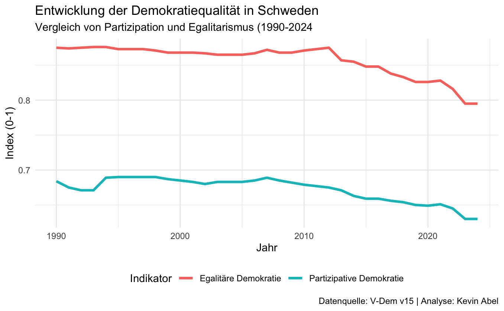

# Analyse der Demokratiequalität in Schweden (1990-2024)

### Projektbeschreibung
Dieses Projekt analysiert die Entwicklung der partizipativen und egalitären Demokratie in Schweden basierend auf Daten des **V-Dem Instituts (v15)**.

Das Ziel ist ein Vergleich verschiedener Demokratie-Indizes im Verhältnis zur politischen Gewalt (Physical Integrity Index) über die letzten drei Jahrzehnte.

### Ergebnisse ansehen
📄 **[Hier klicken, um den vollständigen HTML-Report zu öffnen](Analyse_Schweden.html)**
*(Hinweis: Die HTML-Datei muss heruntergeladen oder über einen Service wie GitHub Pages betrachtet werden, um interaktiv zu sein)*

### Vorschau

### Daten & Methode
* **Datenquelle:** [V-Dem Dataset v15](https://v-dem.net) (Varieties of Democracy).
* **Technologie:** R, Quarto, Tidyverse, ggplot2.
* **Indikatoren:**
  * Partizipative Demokratie (`v2x_partipdem`)
  * Egalitäre Demokratie (`v2x_egaldem`)
  * Physical Integrity Index (`v2x_clphy`)
  * Rechtsstaatlichkeit / Rule of Law (`v2x_rule`)

---
*Autor: Kevin Abel*
